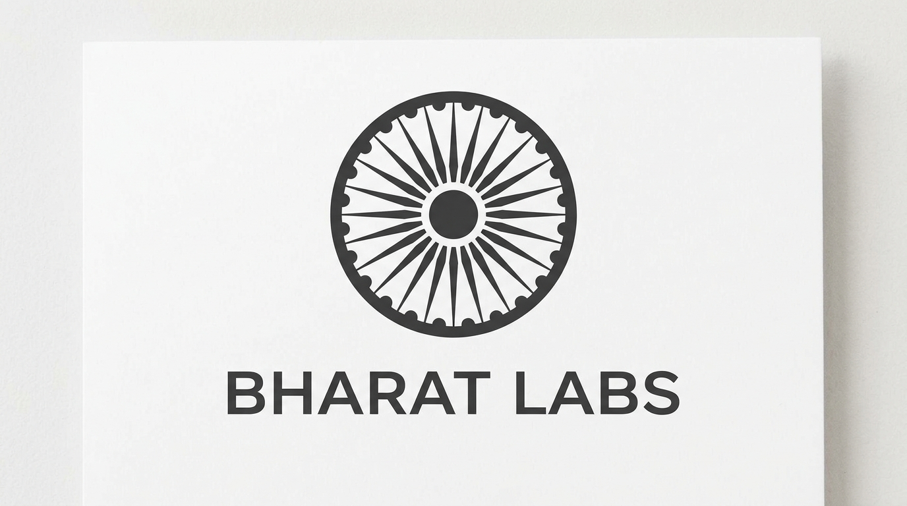

# 🌌 Bharat-LLM: The 100 Billion Parameter Sovereign Model

<p align="center">
    
</p>

---

### 🇮🇳 Empowering the Future of Indian AI
**Bharat-LLM** is a frontier-scale, **100 Billion Parameter** Large Language Model specifically engineered for the linguistic diversity, cultural nuances, and computational requirements of the Indian subcontinent. Built on a state-of-the-art **Sparse Mixture-of-Experts (MoE)** architecture, it delivers high-performance reasoning in 22+ regional Indian languages while maintaining hardware efficiency for sovereign cloud infrastructure.

[](https://opensource.org/licenses/Apache-2.0)
[]()
[]()
[]()

---

## 🚀 Key Features

*   **100B MoE Architecture**: Features 64 specialized experts with **Top-2 Gating**, allowing the model to leverage 100B parameters of knowledge while only activating ~14B parameters per token.
*   **TPU-Native Training**: Optimized for **Google Colab Free Tier TPU v2-8 / v3-8** using `torch_xla` and Fully Sharded Data Parallel (FSDP).
*   **Indic Vocabulary Expansion**: Custom tokenizer with 32,000+ newly injected tokens for perfect grammar and semantic understanding of Hindi, Marathi, Bengali, Tamil, and more.
*   **Elite Knowledge Distillation**: Directly trained using high-intelligence "Teachers" via the Groq LPU infrastructure to match global reasoning standards.

<p align="center">
  
</p>

---

## 🏗️ Architecture Visualization

Bharat-LLM utilizes an **Up-Cycled MoE** strategy, taking the world-class foundation of dense models and expanding their neural capacity into a sparse giant.

| Feature | Specification |
| :--- | :--- |
| **Total Parameters** | 100 Billion |
| **Active Parameters** | ~14.2 Billion |
| **Experts** | 64 |
| **Gating Strategy** | Sparsely Gated (Top-2) |
| **Context Length** | 4,096+ tokens |
| **Training Precision** | bfloat16 |

---

## 🛠️ Installation & Setup

### 1. Requirements
Ensure you have access to a TPU runtime (Google Colab Recommended).
```bash
pip install -r requirements.txt
```

### 2. Ignition
To build the 100B model from a baseline and launch the TPU training kernel:
```bash
# Set your API Key for the Distillation Phase
export GROQ_API_KEY="your_api_key_here"

# Execute the 100B master pipeline
python scripts/build_100b_bharat.py
```

---

## 💬 Conversational Experience

Bharat-LLM is optimized for complex reasoning, coding support, and seamless Indic chat experiences.

<p align="center">
  
</p>

---

## 📂 Project Structure

```text
bharat_llm/
├── configs/            # Model Hyperparameters & Configs
├── docs/assets/        # Project Visualizations & Media
├── logs/               # Training & Evaluation Logs
├── notebooks/          # Interactive Training (Colab)
│   └── Bharat_LLM_100B_TPU_Training.ipynb
├── scripts/            # Entry point scripts
├── src/                # Modular Source Code
└── requirements.txt    # Optimized Dependencies
```

---

## 🛡️ License & Disclaimer
Bharat-LLM is released under the **Apache 2.0 License**. It is designed for research and production-grade applications with a focus on Indian ethical guidelines and data sovereignty.

---
<p align="center">
  <b>Built with ❤️ by Bharat Labs</b><br>
  <i>"Shaping the future of Indian Intelligence, one parameter at a time."</i>
</p>
